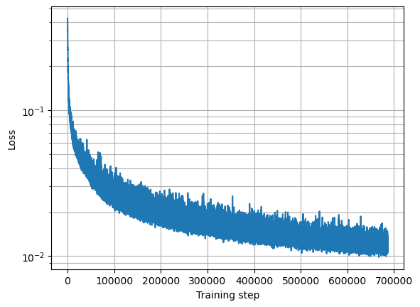
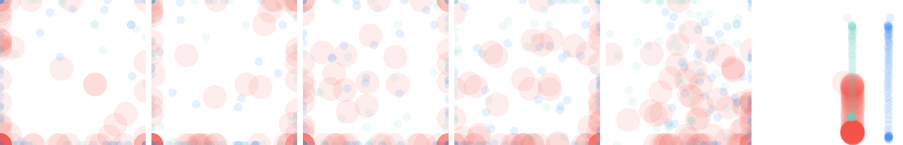
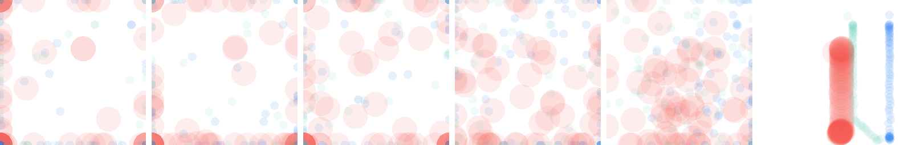
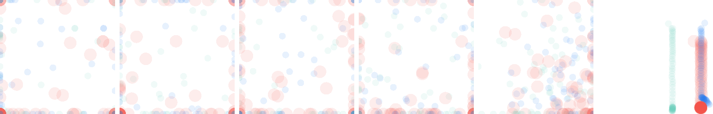

## Abstract and references 
This project is an adaptation of Diffuser, introduced by Janner et al in [Planning with Diffusion for Flexible Behavior Synthesis](https://diffusion-planning.github.io/), to the [PHYRE](https://phyre.ai/) Benchmark for physical reasoning. 
PHYRE presents a set of puzzles in a simulated 2 dimensional physical environment. The goal of each puzzle is to get the green and blue object to touch by placing a red ball and starting the simulation.

Diffuser meanwhile is a planning model based on denoising diffusion. It can be applied to a multitude of problems such as path finding or controlling joints in complex systems. Diffuser allows for dynamic conditioning on discrete goals or objective functions. By planning all time steps simultaneously Diffuser can achieve local and global history. To this end temporal convolutions are employed in the diffusion model.

The goal of this specific project was not to find solutions for PHYRE but to simulate the behavior of the environment given a fixed set of start conditions. This model could then be used either as part of a larger pipeline for solving PHYRE or for finding strategies of dealing with such problems. This project should therefore be seen as a proof of concept of how well suited a base-line Diffusor is towards solving PHYRE.

## Installation instructions

Create your environment using the provided environment.yml

```
conda env create -f environment.yml
```

## Train commands

Create your dataset using the `create_dataset_latents.ipynb` file. Configurate your dataset to your liking in the config section.

The model can be trained using the `train.py` script and your created dataset. 

Trained models may be evaluated using the `eval.ipynb` notebook.

## Performance results (table or figure or image)
Model loss after 700000 iterations:


Loss seems to be decreasing, however after around 200.000-300.000 iterations the sampled trajectories seem to no longer increase in quality.

## A few images representing results and/or architecture pipeline
Sample trajectories generated by the model. Here the start and end points are fixed during sampling. It can be observed, that while the generated trajectory reasonable there is a slight offset from the start and end points. In the below images the final state seems to be reached very abruptly. There are two reasons for this. First, the chosen diffusion process only contains 28 diffusion steps which means that the change in each step is much more drastic than in typical diffusion models. Also since points are chosen randomly at the start most points fall outside of the range of the screen and are clipped to the sides. The diffusion process takes some time to "pull" these points to their final position.





A sample model and dataset can be found in the `model` and `dataset` directories respectively.

## Contact information

Feel free to contact me at lukas.schubert@uni-bielefeld.de if you have any questions.
